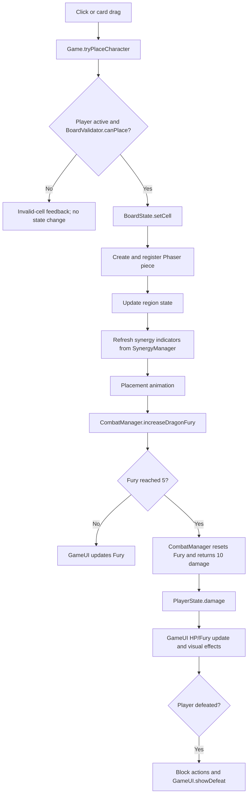
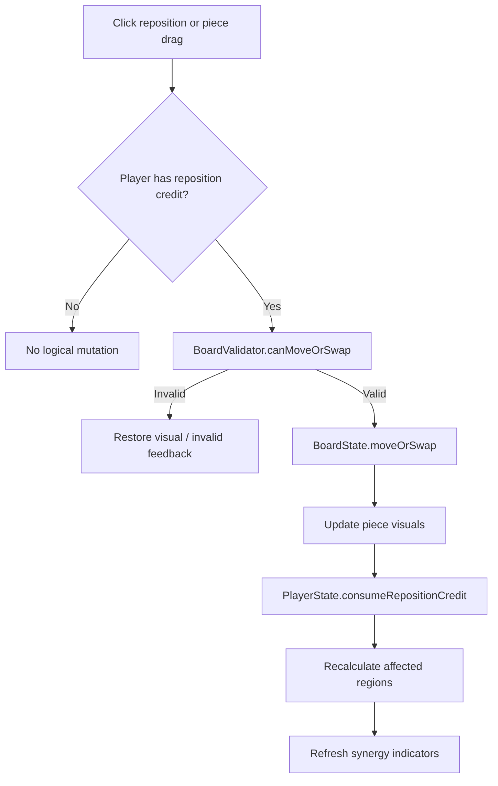
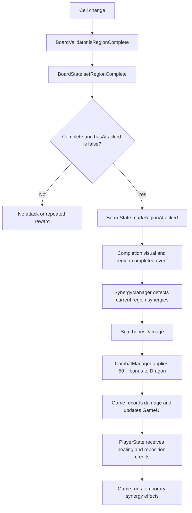
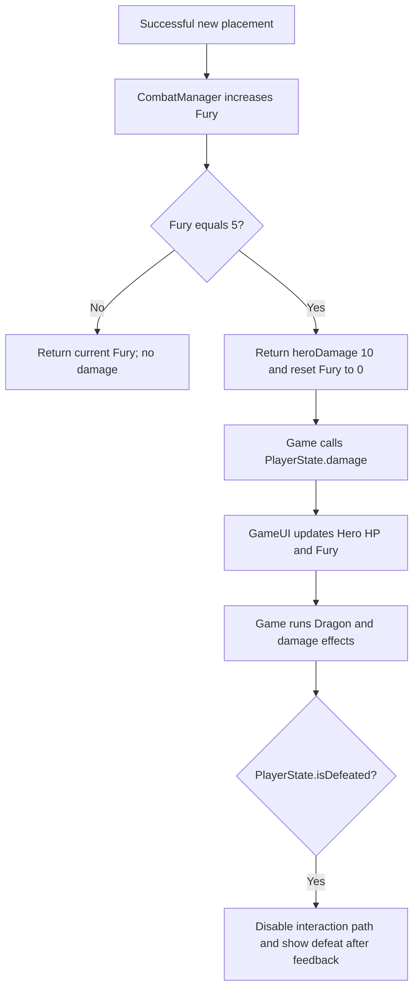

# Architecture

## Overview

O projeto é um jogo web em TypeScript executado por Phaser e empacotado com Vite. Há uma única cena, `Game`, que coordena módulos de estado e regras puras com a apresentação Phaser.

A modularização atual separa configuração de unidades, estado do tabuleiro, validação, detecção de sinergias, estado do jogador, combate e HUD. A cena ainda concentra renderização e interação do tabuleiro, coordenação dos fluxos e efeitos temporários.

## Project Structure

```text
.
├── index.html
├── package.json
├── public/
│   ├── style.css
│   └── assets/
├── src/
│   ├── main.ts
│   └── game/
│       ├── main.ts
│       ├── board/
│       │   ├── BoardState.ts
│       │   └── BoardValidator.ts
│       ├── combat/
│       │   └── CombatManager.ts
│       ├── player/
│       │   └── PlayerState.ts
│       ├── scenes/
│       │   └── Game.ts
│       ├── synergies/
│       │   └── SynergyManager.ts
│       ├── ui/
│       │   └── GameUI.ts
│       └── units/
│           └── UnitConfig.ts
└── vite/
    ├── config.dev.mjs
    └── config.prod.mjs
```

## Module Responsibilities

### Application bootstrap

`src/main.ts` espera `DOMContentLoaded` e chama `StartGame`. `src/game/main.ts` cria a configuração Phaser: canvas lógico de 1920x1080, escala `FIT`, centralização automática e apenas a cena `Game`. A cena carrega `assets/backgrounds/dungeon-01.png` como fundo dimensionado proporcionalmente para cobrir a área lógica.

### `UnitConfig`

Contém `UNIT_IDS`, o union type `UnitType`, `CharacterType`, `UNIT_TEXTURES`, `UNIT_SPRITE_FLIP_X` e a configuração das nove unidades. Cada registro possui ID, nome, símbolo e cor; as duas configurações de sprite associam cada ID à chave Phaser e à orientação visual necessária. `BoardState` usa `UnitType`; `SynergyManager` usa os IDs centralizados; `Game` usa os registros para construir cartas e peças.

Não há regras de Sudoku ou comportamento de classe neste módulo.

### `BoardState`

É a fonte de verdade do conteúdo lógico das células. Usa um `Map<number, BoardUnit>` esparso: ausência no mapa representa célula vazia. Também mantém um mapa com os nove `RegionState`.

Estado próprio:

- unidade lógica em cada célula ocupada;
- `isCurrentlyComplete` por região;
- `hasAttacked` por região.

Operações principais:

- consultar, definir e remover célula;
- mover ou trocar unidades já validadas;
- retornar as nove células de uma região;
- atualizar completude e marcar ataque;
- limpar células e recriar os nove estados de região no reset.

`BoardState` importa apenas o tipo de unidade. Ele não valida se a mutação é legal.

### `BoardValidator`

Implementa regras puras sobre um `ReadonlyMap` do tabuleiro:

- `canPlace` rejeita célula ocupada ou repetição do tipo na linha ou coluna; tipos repetidos são permitidos dentro da mesma região 3x3;
- `canMoveOrSwap` valida simultaneamente o estado final das duas posições, ignorando origem e destino durante a simulação;
- `isRegionComplete` exige que as nove células da região estejam ocupadas;
- `getRegionIndex` converte linha/coluna no índice 0–8 da região.

Depende dos tipos e dimensões de `BoardState`. Não altera estado.

### `SynergyManager`

Contém as definições lógicas das sinergias e seus resultados declarativos:

| Sinergia | Par | Condição | Resultado |
|---|---|---|---|
| Flecha Arcana | Mago + Arqueiro | Adjacência ortogonal na mesma região | `bonusDamage: 10` |
| Manobra Tática | Paladino + Bárbaro | Adjacência ortogonal na mesma região | `repositionments: 1` |
| Bênção da Natureza | Clérigo + Druida | Adjacência ortogonal na mesma região | `healing: 10` |

`areOrthogonallyAdjacent` centraliza a condição de distância de Manhattan igual a 1. `getFormedSynergiesInRegion` retorna todos os pares distintos possíveis para cada sinergia na região, escolhendo aleatoriamente entre parceiros ortogonalmente adjacentes quando houver alternativas; `getAllFormedSynergies` agrega as nove regiões para os indicadores visuais.

O módulo consulta dados lógicos derivados de `BoardState` e IDs de `UnitConfig`. Ele não aplica recompensas e não conhece `hasAttacked`.

### `PlayerState`

É a fonte de verdade do estado do jogador:

- HP inicial e máximo de `100`;
- HP atual limitado entre `0` e `100`;
- derrota quando HP é menor ou igual a zero;
- créditos de reposicionamento, inicialmente `0`;
- consumo unitário de crédito e reset.

Não depende de outros módulos e não decide quando dano, cura ou recompensa acontece.

### `CombatManager`

É a fonte de verdade do combate do Dragão:

- HP inicial e máximo de `500`, limitado a zero;
- Fúria inicial `0` e máxima `5`;
- quinta carga retorna `10` de dano ao Herói e reseta a Fúria;
- dano-base de região `50`;
- cálculo e aplicação de `50 + synergyDamageBonus` ao Dragão;
- reset do HP e da Fúria.

Ele não depende de `PlayerState`: retorna o dano do ataque normal para que `Game` o encaminhe. Também não detecta Flecha Arcana; recebe o bônus calculado a partir do `SynergyManager`.

### `GameUI`

É a camada permanente de HUD. Pode depender de Phaser e mantém referências a textos, barras, painéis e botões.

Cria e atualiza:

- nome, sprite, HP e barra do Dragão;
- Fúria;
- nome, HP e barra do Herói;
- reposicionamentos e botão correspondente;
- histórico de combate;
- overlay de derrota e botão de reinício.

Todos os valores são recebidos por parâmetro. Os callbacks de reposicionamento e reinício informam intenção a `Game`; `GameUI` não altera estado lógico.

### `Game` scene

`Game.ts` é a composição e coordenação da aplicação. Instancia `BoardState`, `PlayerState`, `CombatManager` e `GameUI`, consulta as funções puras de validação e sinergia e conecta os resultados à apresentação.

Responsabilidades ainda presentes:

- layout e desenho do tabuleiro e da área de unidades;
- criação das peças Phaser e mapa `pieceVisuals`;
- hover, seleção, clique, drag-and-drop, previews e feedback inválido;
- coordenação de colocação, movimento e swap;
- modo de reposicionamento e sua seleção de origem;
- transição de completude da região e emissão/escuta de `region-completed`;
- aplicação de cura e créditos retornados pelas sinergias;
- lista de eventos reais de combate (dano, cura e reposicionamento); a apresentação fica em `GameUI`;
- coordenação da derrota e do reinício via `scene.restart()`;
- todos os efeitos temporários: pulsos, shakes, flashes, textos flutuantes, linhas de sinergia e animações de ataque/dano.

O mapa `pieceVisuals` associa células a objetos Phaser, mas não é a fonte de verdade das unidades. Decisões lógicas consultam `BoardState`.

## Sources of Truth

| Informação | Fonte de verdade |
|---|---|
| IDs, nomes, símbolos e cores das unidades | `UnitConfig` |
| Unidades nas células | `BoardState.cells` |
| Completude atual das regiões | `BoardState.regions.isCurrentlyComplete` |
| Região já atacou | `BoardState.regions.hasAttacked` |
| Validade de colocação, movimento, swap e região | `BoardValidator` |
| Sinergias formadas e valores de seus efeitos | `SynergyManager` |
| HP do Herói e derrota lógica | `PlayerState` |
| Créditos de reposicionamento | `PlayerState` |
| HP e Fúria do Dragão | `CombatManager` |
| Dano-base de região e ataque normal do Dragão | `CombatManager` |
| Objetos e valores exibidos no HUD | `GameUI` recebe valores; não é fonte lógica |
| Objetos visuais das peças e efeitos temporários | `Game` |
| Valores exibidos no histórico de combate | lista de eventos em `Game`; renderização em `GameUI` |

## Main Game Flows

### Placement Flow



Both click placement and card drag end call the same `tryPlaceCharacter` method. Only this successful new-placement path calls `increaseDragonFury`.

### Movement and Swap Flow



Origin and destination are ignored together during validation, so a swap is checked against its final state. This flow never increases Dragon Fury.

### Region Completion Flow



`hasAttacked` is marked before the event is emitted. If movement later makes the region incomplete, that flag remains true, so recompleting it cannot reapply damage or rewards.

### Dragon Attack Flow



## Dependency Guidelines

### Domain and game logic

- `UnitConfig` is foundational configuration.
- `BoardState` may depend on unit types.
- `BoardValidator` reads board types/state but must not mutate them.
- `SynergyManager` reads logical board data and unit IDs.
- `PlayerState` and `CombatManager` are independent state owners.
- These modules must remain free of Phaser unless a concrete requirement makes that unavoidable.

### Presentation

- `GameUI` depends on Phaser and only presents supplied values.
- Rendering of the board, pieces and temporary effects currently remains in `Game`.
- No `GameFeel` or effects module exists in the current codebase.

### Coordination

- `Game` may depend on all domain and presentation modules to orchestrate flows.
- Domain modules should not import `Game`, `GameUI` or the Phaser scene.
- Prefer data/results and callbacks across boundaries rather than hidden cross-module mutation.
- Avoid cycles such as `BoardState -> BoardValidator -> BoardState` with runtime dependencies; current `BoardValidator` reads `BoardState` types/constants, while `BoardState` does not import it.

## Adding a New Mechanic

1. Identify which domain owns the rule and state.
2. Extend an existing owner before creating another module.
3. Keep a single source of truth.
4. Return logical results to `Game` for coordination.
5. Put permanent HUD in `GameUI`.
6. Keep temporary animation separate from rule decisions. Currently those effects remain in `Game`; if an effects module is introduced later, document that as a real architectural change.
7. Verify click, drag, invalid-action, reset and first-attack edge cases affected by the mechanic.
8. Run `npx.cmd tsc --noEmit` and `npm.cmd run build` on Windows, or platform equivalents.
9. Update this document when module responsibilities, sources of truth or major flows change.

Architectural example only — not an implemented mechanic: if “Paladino concede escudo” were added, `SynergyManager` could report the condition, `PlayerState` could own a player shield, `CombatManager` or the coordinating flow could account for it during damage, `GameUI` could display it, and the effects layer could animate it. `Game` would coordinate those results. Do not treat this example as current gameplay.

## Architectural Direction

Current state: `Game.ts` still contains board rendering/input and all temporary game-feel effects. `GameUI` handles only the permanent HUD and defeat overlay. There is no victory flow when Dragon HP reaches zero.

Possible future separations may move temporary effects out of `Game`, but they are not implemented architecture and should not be documented as existing modules until created.
